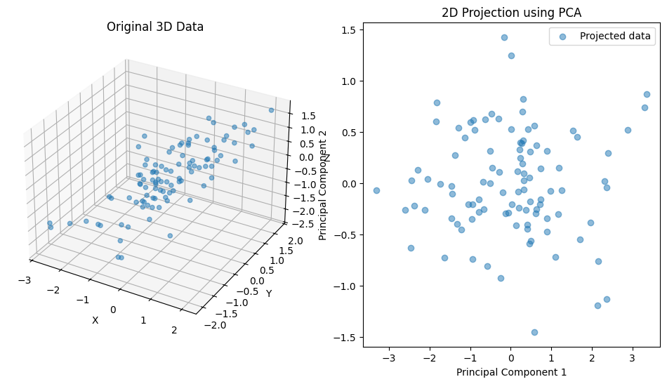

## Introduction

In data analysis and machine learning, we often encounter datasets with a large number of features (dimensions). While large data with a wealth of information are often preferable, high-dimensional data may lead to a series of challenges:
* we may run into computational/ performance issues whe running certain analyses,
* downstream machine learning applications may suffer from the curse of dimensionalty, and 
* visualizing the essential properties of the data may be difficult.

**Dimensionality reduction techniques** aim to reduce the number of features while preserving as much relevant information as possible.

Imagine a simple scenario - you are given a large table of monitoring data on a hydraulic system, consisting of 1000 observations (samples) of 150 physical measurements (features). You are asked to give a presentation on the data. How do you a visualize 150-dimensional data set? 
{: .notice--note} 

One of the most widely used methods for dimensionality reduction is **Principal Component Analysis** (PCA).

Principal Component Analysis (PCA) is a linear transformation technique used for dimensionality reduction. It transforms a dataset with potentially correlated features into a new coordinate system where the axes (called principal components) are orthogonal and ordered by the amount of variance they capture from the data.

## Mathematical Foundations

Let $X \in \mathbb{R}^{n \times p}$ be a data matrix with $n$ observations and $p$ features. The goal of PCA is to find a set of orthogonal vectors (principal components) that capture the directions of **maximum variance** in the data.

---

### 1. Data Centering


To ensure that PCA captures variance around the mean, we first center the data.

Let:

- $X \in \mathbb{R}^{n \times p}$ be the data matrix with $n$ observations (rows) and $p$ features (columns),
- $\mu \in \mathbb{R}^{1 \times p}$ be the **mean vector** of the columns (i.e., the mean of each feature).

Then, to center the data, we subtract the mean vector from each row of $X$:

$$
\tilde{X} = X - \mathbf{1}_n \mu
$$

Where:

- $\mathbf{1}_n \in \mathbb{R}^{n \times 1}$ is a column vector of ones,
- $\mathbf{1}_n \mu \in \mathbb{R}^{n \times p}$ replicates the mean vector across all rows.

This ensures that the subtraction is **broadcasted row-wise**, resulting in a centered matrix $\tilde{X} \in \mathbb{R}^{n \times p}$ where each column has zero mean.


---

### 2. Covariance Matrix

The covariance matrix $\Sigma \in \mathbb{R}^{p \times p}$ summarizes the pairwise covariances between features:

$$
\Sigma = \frac{1}{n-1} \tilde{X}^\top \tilde{X}
$$

This matrix is symmetric and positive semi-definite, which guarantees real, non-negative eigenvalues and orthogonal eigenvectors.

---

### 3. Eigenvalue Decomposition

We perform an **eigenvalue decomposition** of the covariance matrix:

$$
\Sigma v_i = \lambda_i v_i
$$

- $v_i \in \mathbb{R}^p$ are the **eigenvectors** (principal directions),
- $\lambda_i \in \mathbb{R}$ are the **eigenvalues** (explained variances),

The eigenvectors are **orthonormal**: $v_i^\top v_j = \delta_{ij}$

The eigenvalues are sorted in descending order: $\lambda_1 \geq \lambda_2 \geq \dots \geq \lambda_p .$

---

### 4. Dimensionality Reduction

To reduce the dimensionality from $p$ to $k$ (with $k < p$), we select the top $k$ eigenvectors and form the projection matrix:

$$
W_k = [v_1, v_2, \dots, v_k] \in \mathbb{R}^{p \times k}
$$

The transformed data in the reduced space is:

$$
Z = \tilde{X} W_k
$$

---

### 5. Explained Variance

The proportion of variance explained by the $i$-th principal component is:

$$
\text{Explained Variance Ratio}_i = \frac{\lambda_i}{\sum_{j=1}^{p} \lambda_j}
$$

This metric is crucial for determining how many components to retain.

### Intuition

**Note:** PCA finds the best-fitting plane (or line, in 2D) that captures the most variance. The data is then projected onto this new coordinate system. This projection is a rotation (and scaling) of the original axes, followed by a dimensionality reduction.
{: .notice--note} 


---


### Visualization

Below is a simple python demonstration. Usually, we reduce high-dimensional data (say, a 100-feature data set) to a human-readable form (say, a 2D or 3D plot). For the sake of this example, we will reduce "high"-dimensional data (3D) to "low"-dimensional data.

First, let us generate some synthetic 3D Data:

```python
import numpy as np
import matplotlib.pyplot as plt
from sklearn.decomposition import PCA as sklearnPCA

# Create a synthetic 3D dataset with correlated features
np.random.seed(42)
mean = [0, 0, 0]
cov = [[1, 0.8, 0.8], [0.8, 1, 0.8], [0.8, 0.8, 1]]
data = np.random.multivariate_normal(mean, cov, 100)
```

Then center the data

```python
data_centered = data - np.mean(data, axis=0)
```

Compute the covariance matrix

```python
cov_matrix = np.cov(data_centered, rowvar=False)
```

Eigen Decomposition: we extract the eigenvalues and eigenvectors of the covariance matrix.

```python
eigenvalues, eigenvectors = np.linalg.eigh(cov_matrix)

# Sort eigenvalues and eigenvectors in descending order
sorted_index = np.argsort(eigenvalues)[::-1]
eigenvalues = eigenvalues[sorted_index]
eigenvectors = eigenvectors[:, sorted_index]
```

Finally, project the data onto the first two principal components.

```python
projected_data = np.dot(data_centered, eigenvectors[:, :2])
```

The code above follows the mathematical explanation. Alternatively, we can easily achieve the same result using scikit-learn:

```python
pca = sklearnPCA(n_components=2)
sklearn_projected_data = pca.fit_transform(data)
```

Let's plot the result, both our own PCA and the scikit learn alternative.

```python
fig = plt.figure(figsize=(12, 6))

# Original 3D data
ax = fig.add_subplot(121, projection='3d')
ax.scatter(data[:, 0], data[:, 1], data[:, 2], alpha=0.5)
ax.set_title('Original 3D Data')
ax.set_xlabel('X')
ax.set_ylabel('Y')
ax.set_zlabel('Z')

# Projected 2D data
ax = fig.add_subplot(122)
ax.scatter(projected_data[:, 0], projected_data[:, 1], alpha=0.5, label='PCA projection')
ax.set_title('2D Projection using PCA')
ax.set_xlabel('Principal Component 1')
ax.set_ylabel('Principal Component 2')
ax.legend()

plt.show()
```



There is also a convenient `scikit learn` implementation of PCA.
{: .notice--note} 