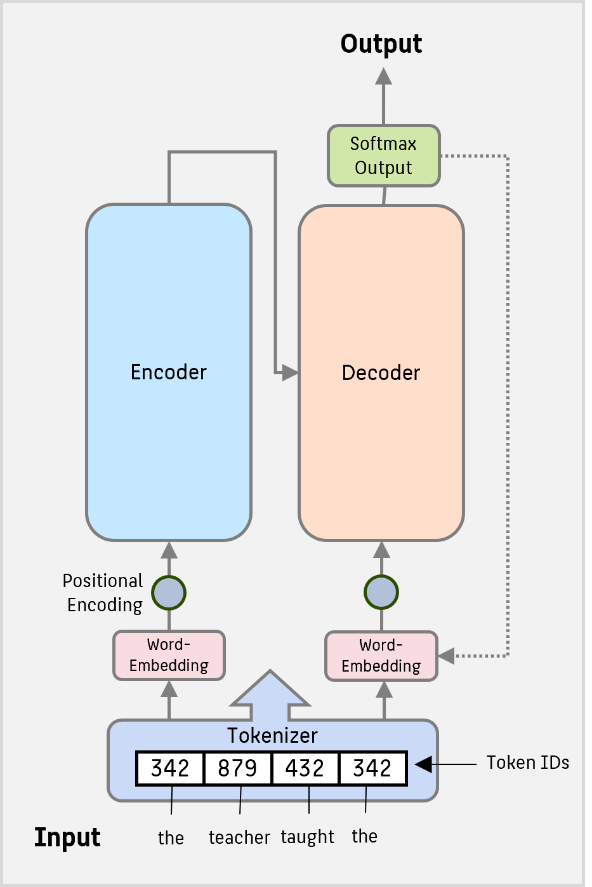

Mit dem Aufkommen von ChatGPT & Co haben _Vektordatenbanken_ besondere Aufmerksamkeit erlangt erlangt. Der Grund: _Large Language Models_ haben zahlreiche neue und aufregende Anwendungen ermöglicht. Eine bekannte Einschränkung von ChatGPT ist aber, dass ein trainiertes Sprachmodell keine Kenntnisse über aktuelle Ereignisse hat und keine Informationen aus Dokumenten besitzt, auf denen es nicht trainiert wurde. Also muss das LLM mit einer Wissensbasis angereichert werden - und dieses Wissen wird sehr häufig in Form einer _Vektordatenbank_ abgelegt.

Vektordatenbanken spielen schon seit langer Zeit in der Geoinformationstechnologie eine große Rolle. Im Gegensatz zu herkömmlichen relationalen Datenbanken setzen Vektordatenbanken auf die Speicherung in Form von Vektoren, die Punkte, Linien oder Polygone repräsentieren. Dies ermöglicht eine präzise Modellierung und Analyse räumlicher Informationen. Durch die Kombination von KI-Algorithmen mit (Echtzeit-)Geoinformationen sind in der Vergangenheit innovative standortbasierten Dienste, Navigationssysteme und städtische Planungslösungen entstanden. 

Wenn wir jedoch möchten, dass Computer und klassische Machine Learning Algorithmen natürliche Sprache verstehen, müssen wir die sequentielle, zeichenbasierte Darstellung in ein für die Algorithmen maschinenverständliches Format umwandeln.

Historische Ansätze, die auch Grundlage für die meisten Stichwortsuchen im Web waren, gehen auf Worthäufigkeiten oder [N-Gram](https://de.wikipedia.org/wiki/N-Gramm)-Häufigkeiten in Dokumenten zurück, später kam das Prinzip der **Embeddings** auf. Wir können Embeddings für Wörter, Sätze und sogar Bilder berechnen. Embeddings sind ebenfalls Vektoren aus Zahlen, aber sie können Bedeutung erfassen. Man kann sie also für semantische Suchen verwenden und sogar mit Dokumenten in verschiedenen Sprachen arbeiten. 

Im Folgenden versuchen wir, einen Gesamtüberblick über die Zusammenhänge zwischen Embeddings, ChatGPT und Vektordatenbanken zu liefern.

## Wichtige Ansätze für Text Embeddings

### Naive Anfänge

[Dieses Tutorial zu **Word embeddings**](https://www.tensorflow.org/text/tutorials/word_embeddings) erklärt detailliert, wie man ein neuronales Netz trainiert, welches aus Texten (also Strings, als Input) einen Latent Space lernt, der für jedes Wort einen Vektor als numerische Repräsentation angibt. Zu Beginn zeigt es die einfachste und naivste Variante, ein Wort als Vektor darzustellen: als One-Hot-Encoding über das Vokabular:


Jedes Wort wird also umgewandelt in einen spärlichen Vektor $w$ mit der Länge $\vert V \vert$ für ein Vokabular $V$. Dieser Ansatz ist sehr einfach, aber auch sehr ineffizient. Ganze Sätze erhält man so noch nicht, aber man sie abbilden z.B. als Mittelwert oder Summe von One-Hot-Wort-Vektoren. Das führt uns zum nächsten Ansatz: 

### Bag of Words

Der ein leicht weiter gehender Ansatz zur Umwandlung von Texten in Vektoren ist das [Bag-of-Words](https://en.wikipedia.org/wiki/Bag-of-words_model)-Modell. 

Der erste Schritt zur Erstellung eines Bag-of-Words-Vektors besteht darin, den Text in Wörter (Tokens) zu zerlegen und diese dann auf ihre Grundformen zu reduzieren. Zum Beispiel wird „running“ in „run“ umgewandelt. Dieser Prozess wird **Stemming** genannt. Dafür kann man das Python-Paket **NLTK** verwenden:

```python
from nltk.stem import SnowballStemmer
from nltk.tokenize import word_tokenize

text = 'We are lucky to live in an age in which we are still making discoveries'

# tokenization - splitting text into words
words = word_tokenize(text)
print(words)
# ['We', 'are', 'lucky', 'to', 'live', 'in', 'an', 'age', 'in', 'which',
#  'we', 'are', 'still', 'making', 'discoveries']

stemmer = SnowballStemmer(language = "english")
stemmed_words = list(map(lambda x: stemmer.stem(x), words))
print(stemmed_words)
# ['we', 'are', 'lucki', 'to', 'live', 'in', 'an', 'age', 'in', 'which', 
#  'we', 'are', 'still', 'make', 'discoveri']
```
Nun haben wir eine Liste der Grundformen aller Wörter. Der nächste Schritt besteht darin, ihre Häufigkeiten zu berechnen, um daraus einen Vektor zu erstellen.
```python
import collections
bag_of_words = collections.Counter(stemmed_words)
print(bag_of_words)
# {'we': 2, 'are': 2, 'in': 2, 'lucki': 1, 'to': 1, 'live': 1, 
# 'an': 1, 'age': 1, 'which': 1, 'still': 1, 'make': 1, 'discoveri': 1}
```
**Anmerkung:** Tatsächlich müssten wir, wenn wir unseren Text in einen Vektor umwandeln wollen, nicht nur die Wörter im Text selbst berücksichtigen, sondern erneut das gesamte Vokabular $V$. 
{: .notice--note} 

So erhalten wir für einen konkreten Satz, Text oder ein Dokument stets einen Vektor $s$ mit der Länge $\vert V \vert$. Dieser Ansatz ist ziemlich einfach und berücksichtigt darüber hinaus nicht die semantische Bedeutung der Wörter. Daher wären die Sätze 
> „The girl is studying data science“ 

und  
> „The young woman is learning AI and ML“  

nicht nahe beieinander im Vektorraum.


**Arbeitsauftrag (optional)**: Eine große Schwäche des naiven Bag-of-Words-Ansatzes ist es, dass er Stoppwörtern (ein, und, das, ...) viel zu viel Bedeutung zumisst. Ein etwas smarterer Ansatz, der auf dem Bag of Words aufbaut, ist die sogenannte [**TF-IDF**-Methode](https://en.wikipedia.org/wiki/Tf%E2%80%93idf). Machen Sie sich bei Interesse selbstständig mit diesem Vorgehen vertraut.
{: .notice--task} 

### Word2Vec 

Bag of Words scheitert daran, semantisch ähnliche Inhalte auch nahe abzubilden. Einer der bekanntesten Ansätze zum semantik-treuen Text Embedding ist **word2vec**, das 2013 von Google in dem Paper *„Efficient Estimation of Word Representations in Vector Space“* von Mikolov et al. vorgestellt wurde.

In dem Paper werden zwei verschiedene word2vec-Ansätze beschrieben:

- **Continuous Bag of Words (CBOW):** Hierbei wird ein Wort auf Basis der umgebenden Wörter vorhergesagt.
- **Skip-gram:** Das Gegenteil – hier wird der Kontext auf Basis eines einzelnen Wortes vorhergesagt.

Die grundlegende Idee ist leicht verwandt zu der unseres Autoencoders: wir wollen zwei Modelle trainieren: wieder eine Art **"Encoder"** und einen **"Decoder"**. 

Zum Beispiel: Im Fall von **Skip-gram** könnten wir das Wort „christmas“ an eine Art Encoder übergeben. Dieses erzeugt dann einen Vektor (Projection), den wir an den Decoder weitergeben – mit der Erwartung, dass dieser die Wörter „merry“, „to“ und „you“ vorhersagt. 

Im zweiten Beispiel soll ein Encoder-Modell zuerst eine Projektion von mehreren Worten berechnen, aus der anschließend ein Deocder erraten soll, welches Wort bei "merry ___ to you" fehlt:


Probieren Sie es selbst aus: der [Tensorflow Embedding Projector](https://projector.tensorflow.org/) erlaubt das interaktive Spielen mit derartigen bestehenden Embeddings.
{: .notice--task} 

Aus der Arbeitsweise von Word2Vec wird vermutlich klar, dass hier semantisch ähnliche Begriffe auch nahe beeinander im Vektorraum liegen, denn es ist sehr denkbar, dass z.B. die Worte "christmas" und "holidays" im Vorhersagemodell ähnliche Wortfolgen produzieren: "we wish you happy _______". 
{: .notice--info}

**Arbeitsauftrag (optional)**: Aber auch dieser Ansatz geht noch smarter. Das Modell ignoriert die _Morphologie_ der Wörter – also Informationen, die wir aus Wortbestandteilen gewinnen können, wie zum Beispiel, dass „-less“ auf das Fehlen von etwas hinweist. Dieser Nachteil wurde später durch die Betrachtung von **Subword**-Skip-Gram Ansatzes in **GloVe** adressiert. Auch dies überlassen wir dem Leser optional zum Selbststudium.
{: .notice--task} 

Außerdem kann word2vec erneut nur mit einzelnen Wörtern arbeiten, aber wir möchten ganze Sätze codieren. Der einfachste Ansatz, dies zu erreichen, ist vermutlich erneut das **Pooling**: die Wort-Vektoren aller Worte im Satz werden einfach aufaddiert (und ggf. normiert) - dabei gehen aber natürlich semantische Feinheiten zur Reihenfolge der Worte verloren. Die Sätze 
> "Ich gehe heute nicht schwimmen" 

und 
> "Nicht ich gehe heute schwimmen" 

haben eine völlig verschiedene Bedeutung, aber eine identische gepoolte Vektor-Darstellung. Deshalb gehen wir nun zum nächsten evolutionären Schritt über: den Transformers.


### Transformer

Der nächste Entwicklungsschritt war mit dem Transformer-Ansatz verbunden, der im Paper *„Attention Is All You Need“* von Vaswani et al. vorgestellt wurde. Transformer-Modelle konnten informationsreiche, dichte (im Sinne von: nicht spärlich, wie BagOfWords) Vektoren erzeugen und wurden zur dominierenden Technologie für moderne Sprachmodelle.

Die Funktionsweise aktueller Transformer ist  komplex und Gegenstand einer eigenen [ML-Vorlesung](https://htw-berlin-ki-werkstatt.github.io/ml-lecture/lectures/09/09/), weshalb wir dies hier (noch) nicht sehr vertiefen. 

Als Intuition eines aktuellen Transformers sei hier nur erwähnt, dass auch diese wieder aus einem Encoder- und einem Decoder-Teil bestehen, die gemeinsam trainiert werden:



Der **Encoder**-Teil des Transformers ist dabei ein Modell, das Texte nicht sequenziell (Wort für Wort), sondern parallel (alle Input-Worte gleichzeitig) verarbeitet – und dabei einen "Attention-Mechanism" nutzt, um zu entscheiden, welche Wörter im Satz wichtig füreinander sind. Das Wort „bank“ wird so z.B. je nach Satzkontext anders verstanden („river bank“ vs. „money bank“). Aufgrund der variablen Länge von Sätzen in natürlicher Sprache werden diese in Praxis überlicherweise auf eine maximale Länge gebracht (z. B. 128 Tokens, durch Abschneiden oder Auffüllen mit Leerwörtern). Output des Encoders ist anschließend ein Vector-Embedding eines gesamten Satzes. 

Der **Decoder**-Teil des Transformes nimmt als Input die Encoder-Ausgabe sowie ein (potenziell leeres) Start-Prompt und generiert basierend darauf neuen Text. Wichtig dabei: der Decoder geht iterativ vor, d.h. basierend auf dem (konstanten) Encoder-Wert und dem Prompt-Kontext aus Schritt $i$ wird der Decoder-Output erstellt, der wiederum den Prompt-Kontext für Schritt $i+1$ bildet. 

Encoder und Decoder werden prinzipiell gemeinsam trainiert - je nach Anwendung aber auf unterschiedlichen Daten, z.B. 

* für Übersetzungen nutzt man Satzpaare aus zwei Sprachen (Input Encoder DE, Output Decoder ENG), 
* für Textzusammenfassungen (Input lang, Output kurz) oder
* für Frage-Antwort-Paare.

**Vorsicht:** Es wird leider noch komplizierter. Auch wenn das bekannte ChatGPT _eigentlich_ ein Transformer ist, ist es in Wirklichkeit nur der Decoder-Teil eines Transformers (sog. "Decoder only Transformer"). ChatGPT erstellt also nur iterativ _completions_ unserer Prompts, indem es Stück für Stück die wahrscheinlichste Fortsetzung errät. Trotzdem kann ChatGPT Übersetzungen, Frage-Antwort-Paare etc. vornehmen - dies liegt aber in diesem Fall an der großen Vielfalt der Trainingsdaten, aus denen es unsere Prompts vervollständigen kann.

Der Decoder eines Transformers ist also schon mal nützlich. Aber der Encoder ist es auch: mit ihm können wir semantisch repräsentative Repräsentationen (Embeddings) ganzer Sätze erstellen.


## Anwendung von Embeddings: Semantische Suche mit k-Nearest Neighbor im Latent Space


Ein Anwendungsfall dieser vektorisierten Datenrepräsenation liegt damit extrem nahe: stellen Sie sich eine Wissensbasis vor (z.B. Website, Sharepoint, Dokumentensammlung), die mit Hilfe eines Encoders als Embeddings bzw. Vektoren abgelegt wurde. Wir können nun mit einer Anfrage (Query) in natürlicher Sprache in dieser "Datenbank" suchen, indem wir unseren Query ebenfalls als Vektor embedden und die $k$ nächsten (ähnlichsten) Dokumentvektoren als Ergebnis der Suche ausgeben. Dazu berechnen wir die Distanzen des Vektors zu allen Einträgen (= Vektoren = Punkten) in der Datenbank und geben die nächsten $k$ Nachbarn im Raum aus. Damit haben wir eine Dokumentensuche implementiert, die nicht rein auf Schlagworten basiert, sondern echte sprachlich-semantische Ähnlichkeiten beachtet.

## Weiterführende Anwendung: RAG

Am Ende fügt sich alles zusammen. Wie am Anfang erwähnt haben moderne Sprachmodelle den Nachteil, dass sie nur über statisches Wissen verfügen. **RAG** (Retrieval-Augmented Generation) ist ein Ansatz, bei dem ein Sprachmodell wie GPT mit einer externen Wissensquelle kombiniert wird. Anstatt sich nur auf das im Modell gespeicherte Wissen zu verlassen, sucht RAG bei jeder Anfrage in einer Datenbank oder Wissensbasis nach relevanten Informationen (Retrieval, z. B. eben über Embeddings und semantische Suche). Diese Informationen werden dann (als Text, nicht als Vektor!) dem originalen Prompt hinzugefügt (augmentiert), sodass das Modell auf aktuelle oder domänenspezifische Inhalte zugreifen kann. So verbindet RAG die Vorteile von Informationsabruf (retrieval) mit Textgenerierung (generation).


## Noch mehr Anwendungen

Während wir diverse Anwendungen des Decoder-Teils eines Transformers tagtäglich im Umgang mit ChatGPT erleben, bieten die Textembeddings des Encoders ebenfalls viele weitere Anwendungen. Embeddings dieser Art kodieren die semantische Aussage eines Textes, können also in Kombination mit klassischen ML-Algorithemn verwendet werden, z.B. für 
* Textklassifikation, z.B. Spam vs. No-Spam 
* Named Entity Recognition, z.B. „Angela Merkel ist Bundeskanzlerin“ → [Angela Merkel] = Person, [Bundeskanzlerin] = Titel
* Satzähnlichkeiten, Clustering, Visualisieren, Anomaliedetektion etc.

## Approximate $k$ -NN: Vektordatenbanken

Effiziente Algorithmen für *k-Nearest-Neighbors* sind seit langem Gegenstand der Forschung. Leider sinkt die Performance einer brute force Suche stark sowohl mit der Dimension des Latent Spaces als auch der Größe der Datenbank.  

*Überlegen Sie mal*: Was ist die Komplexitätsklasse einer brute force Semantischen Suche eines $k$-Nearest-Neighbor-Algorithmus mit Euklidscher Distanz in einem D-dimensionalen Vektorraum mit N bestehenden Vektoren?
{: .notice--task} 

<!-- 
Die Komplexitätsklasse einer brute force Suche eines k-Nearest-Neighbor-Algorithmus mit Euklidscher Distanz in einem D-dimensionalen Vektorraum mit N bestehenden Vektoren ist O(ND)1. Das bedeutet, dass die Laufzeit des Algorithmus proportional zur Anzahl der Dimensionen D und zur Anzahl der Vektoren N ist. Um die Klassifizierung eines neuen Punkts zu bestimmen, muss der Algorithmus die euklidische Distanz zwischen diesem Punkt und allen anderen Punkten im Datensatz berechnen2. Dies erfordert D Multiplikationen und D-1 Additionen für jeden Punkt, also insgesamt ND Multiplikationen und N(D-1) Additionen. Die Komplexität hängt also nur von N und D ab, nicht von k3.
-->

Zum Glück existiert eine Reihe von Approximationsalgorithmen, die das Ergebnis deutlich beschleunigen, zum Beispiel
* Navigable Small World Search
* Hierarchical Navigable Small World (HNSW) Search
welche eine Laufzeit von nur $O(\log N)$ aufweisen.

Diese Approximationsalgorithmen legen zusätzliche Metadaten im Vektorraum an, die die Suche beschleunigen. Diese Vorgehensweise macht den Kern von *Vektordatenbanken* aus, welche Sammlungen von Vektoren verwalten und schnell durchsuchbar machen.

Dieses [beigefügte Jupyter Notebook](vector_database.ipynb) (siehe Quellenangaben im Notebook) zeigt, wie man eine Vektordatenbank mit Daten füllt und einen Query gegen die Datenbank laufen lässt.

**Aufgabe:**  Studieren Sie das Jupyter Notebook und machen Sie sich mit der grundsätzlichen Funktionsweise einer Vektordatenbank vertraut. 
{: .notice--task} 

**Anmerkung:**  Leider ist der zugrundeliegende Client für die Vektordatenbank nicht Windows-kompatibel, sie sollten also auf ein Linux-basiertes System wechseln oder WSL nutzen. Falls Sie WSL nutzen, möchten Sie dort vielleicht vorher auch [Anaconda installieren](https://gist.github.com/kauffmanes/5e74916617f9993bc3479f401dfec7da). 
{: .notice--info} 

**Anmerkung 2:**  Falls Sie gute Erfahrungen mit konkreten Anbietern von Vektordatenbanken gemacht haben - teilen Sie Ihr Wissen gern! 
{: .notice--info} 


## ⚑ Quellenangaben

Dieses Modul wurde in Teilen auf Basis des Kurses *Vector Databases: from Embeddings to Applications* von Andrew Ng (DeepLearning.AI) und Sebastian Witalec (Weaviate) erstellt [(Link zum Kurs)](https://www.deeplearning.ai/short-courses/vector-databases-embeddings-applications). Es übernimmt weiterhin Inhalte aus einem [Tensor Flow Tutorial zu Text Embeddings](https://www.tensorflow.org/text/tutorials/word_embeddings) sowie [einem Blog Post zu Text Embeddings](https://towardsdatascience.com/text-embeddings-comprehensive-guide-afd97fce8fb5/) von Mariya Mansurova.
{: .notice--info}


[^1]: Tomas Mikolov, Ilya Sutskever, Kai Chen, Grec Corrado, Jeffrey Dean: [Distributed Representations of Words and Phrases and their Compositionality.](https://papers.nips.cc/paper/2013/file/9aa42b31882ec039965f3c4923ce901b-Paper.pdf)

